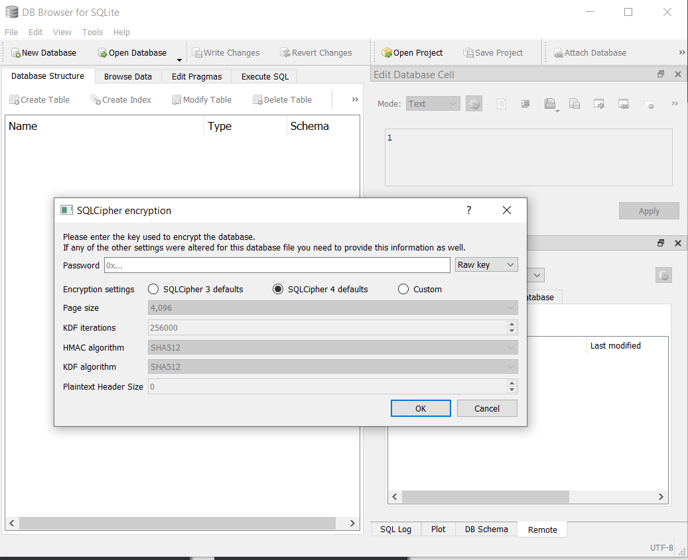
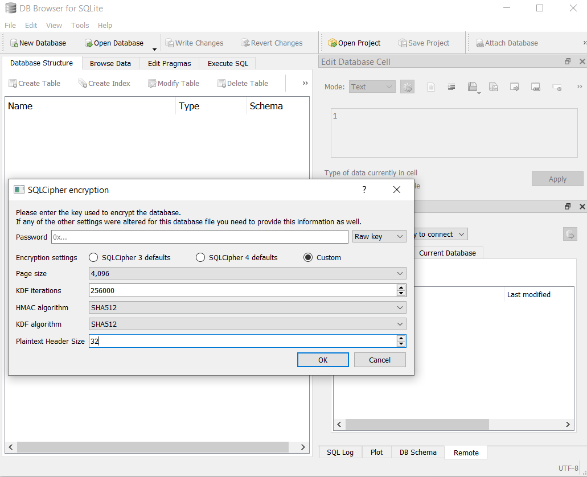
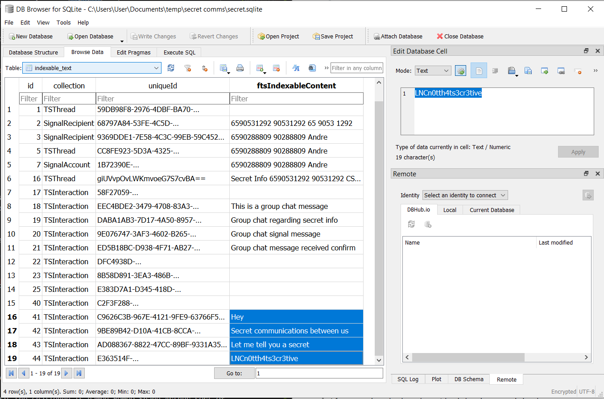

# LagNCrash CTF Writeups
Team Name: &lt;h1> cool name &lt;/h1>

LagNCrash CTF (AKA Interpoly CTF)  
Date: 10 - 12 March 2021 (48 hours)  
<https://ctf.lagncrash.com/>  

Writeups for the top 3 challenges solved by our team:
- [BruteForce?](#bruteforce)
- [secret communications](#secret-communications)
- [Romeo Shane Arthur](#romeo-shane-arthur)

## BruteForce?
Category: Crypto  
Points: 409  
### Description
Do we really need to brute force a password out?  

**Hint:** The zip was encrypted with legacy encryption, can some sort of attacks break this?

Challenge file: [brute_force.zip](brute_force.zip)

### Solution (TL;DR)

Looking in `brute_force.zip`:
```
bruteforce.zip
├── Desktop.zip
│   ├── answer          
│   │   └── flag.txt    [Encrypted]
│   └── readme.txt      [Encrypted]
└── readme.txt          [Cleartext]
```

The double readme files suggests a known-plaintext attack. I found [bkcrack by kimci86](https://github.com/kimci86/bkcrack) to be useful for this.

Having `Desktop.zip`, `brute_force.zip`, and bkcrack in my directory:

Getting the decryption keys:  
`bkcrack -C Desktop.zip -c readme.txt -P brute_force.zip -p readme.txt`  

Copy paste the previous output (the keys) to the decryption command:  
`bkcrack -C Desktop.zip -c "answer/flag.txt" -k 43a39e40  bec2896 f893722e -d decrypted.txt`

Finally uncompress the file using bkcrack tools:  
`tools/inflate.py < decrypted.txt > decompressed.txt`

Now in `decompressed.txt` we have the flag LNC{plain_t3xt_BRO0T_F0RCE}

### Solution

Unzipping the `bruteforce.zip` (**not encrypted**), there is:
```
bruteforce.zip
├── Desktop.zip
└── readme.txt
```

Viewing the contents of `Desktop.zip` file (**is encrypted**), there is:
```
Desktop.zip
├── answer
│   └── flag.txt
└── readme.txt
```

So now we have to figure out how to decrypt the `Desktop.zip` file to get `flag.txt`

Something notable is that the `readme.txt` file is present in both zip files -- perhaps they both contain the same info? 

*Side note: The contents of the unencrypted `readme.txt` is simply "pleasedontseethis!!!"*

Based on the hint, I searched up for clues on breaking the legacy encryption and found **this tool called [bkcrack by kimci86](https://github.com/kimci86/bkcrack)**:
> Crack legacy zip encryption with Biham and Kocher's known plaintext attack

It requires that at least 12 bytes of known plaintext must be known. Guessing that the readme files (> 12 bytes) might have the same content, we can use that for the known plaintext attack.

At first, I just copy-pasted one of the commands in bkcrack's readme -- Something about specifying the plaintext file and the encrypted file -- it did not work

```
C:\Users\User\Documents\temp\brute_force>bkcrack -C Desktop.zip -c readme.txt -p readme.txt
bkcrack 1.0.0 - 2020-11-11
Generated 4194304 Z values.
[20:57:59] Z reduction using 12 bytes of known plaintext
100.0 % (12 / 12)
613546 values remaining.
[20:58:00] Attack on 613546 Z values at index 7
100.0 % (613546 / 613546)
[21:15:38] Could not find the keys.
```

After some thinking I realized it may have been because the zip compression messes up some of the bytes:  
The `readme.txt` in `Desktop.zip` is compressed and encrypted,  
The known plaintext file I specified was not compressed nor encrypted.  
Instead, I should be giving in a plaintext file that is compressed but not encrypted. (i.e. **The only difference between the encrypted and plaintext files should be the encryption** -- that is what the known plaintext attack is)

Reading through the bkcrack's readme and `bkcrack -h` to properly understand the program and arguments to put in, I managed to get it to work:

The format of the command is:  
`bkcrack -C encrypted_zip -c encrypted_file -P unencrypted_zip -p plaintext_file`

You first specify the `encrypted_zip` (`Desktop.zip`) and `unencrypted_zip` (`brute_force.zip`). Using the zip files (assuming the compression algorithm is the same) ensures that both of them are compressed, so the only difference is that one is encrypted and one isn't. Then, specify which files in the zips are the ciphertext and plaintext. For this challenge, we are comparing the `readme.txt` file (same name in both of the zips), so we will use that as the `encrypted_file` and `plaintext_file`.

```
C:\Users\User\Documents\temp\brute_force>bkcrack -C Desktop.zip -c readme.txt -P brute_force.zip -p readme.txt
bkcrack 1.0.0 - 2020-11-11
Generated 4194304 Z values.
[20:58:37] Z reduction using 14 bytes of known plaintext
100.0 % (14 / 14)
533213 values remaining.
[20:58:39] Attack on 533213 Z values at index 7
Keys: 43a39e40  bec2896 f893722e
72.1 % (384445 / 533213)
[21:11:58] Keys
43a39e40  bec2896 f893722e
```

From this we get the keys `43a39e40  bec2896 f893722e`.

*Note: The `Desktop.zip` and `brute_force.zip` should be in the same directory for the above command to work*

The final step is to use the keys output to **decrypt** and **decompress** the encrypted `flag.txt`

```
C:\Users\User\Documents\temp\brute_force>bkcrack -C Desktop.zip -c "answer/flag.txt" -k 43a39e40  bec2896 f893722e -d decrypted.txt
bkcrack 1.0.0 - 2020-11-11
Wrote deciphered text.

C:\Users\User\Documents\temp\brute_force>inflate.py < decrypted.txt > decompressed.txt
```

*Note: `inflate.py` is under the [tools folder of bkcrack](https://github.com/kimci86/bkcrack/tree/master/tools)*

And there we go! Opening `decompressed.txt` there is the flag LNC{plain_t3xt_BRO0T_F0RCE}

## secret communications
Category: Crypto  
Points: 280
### Description

Just give me a Signal to decrypt this message!

The flag format will be LNC{xxxx_xxxx_xxxx}

Challenge files: [keychains.txt](keychains.txt) and [secret.sqlite](secret.sqlite)

### Solution (TL;DR)

Googling "signal sqlite keychain", I found [this note by Magpol on decrypting Signal's sqlite database](https://github.com/Magpol/HowTo-decrypt-Signal.sqlite-for-IOS):

It mentions a `GRDBDatabaseCipherKeySpec` key in the keychain for the Signal app, which our `keychains.txt` also has: 

```
...
Account: GRDBDatabaseCipherKeySpec
...
Keychain Data (Hex): 0x26c864d5999a643ec4dc7dd3e575ef8d88a9649cf7f43d92ead40abe1e587e885e4fe2d415f56628220f5231c34637a3
...
```

As for the `secret.sqlite` file, we can decrypt it with [DB Browser for SQLite (SQLCipher)](https://sqlitebrowser.org/) by setting Plaintext Header Size = 32 (As mentioned in [the note by Magpol](https://github.com/Magpol/HowTo-decrypt-Signal.sqlite-for-IOS)), and using the hex keychain data as the raw key.

By manually browsing in the `indexable_text` table, I found a message "LNCn0tth4ts3cr3tive". To get the final flag, I simply format it as given in the description: LNC{n0t_th4t_s3cr3tive}

### Solution

First thing that I noticed is that the description said "Signal" ... with the whole [whatsapp privacy thing](https://www.theguardian.com/technology/2021/jan/24/whatsapp-loses-millions-of-users-after-terms-update) that went on a while back and people moving to the Signal app, this gave me a clue:

Searching up "signal sqlite keychain" on google, I managed to find something that seems to be very promising: [HowTo-decrypt-Signal.sqlite-for-IOS by Magpol](https://github.com/Magpol/HowTo-decrypt-Signal.sqlite-for-IOS)  
> Signal is storing the DB-key in the keyvalue "GRDBDatabaseCipherKeySpec" ... The Key and value are then stored in the keychain.

Doing a **Ctrl+F in `keychain.txt`,** there is the same **`GRDBDatabaseCipherKeySpec`**:


```
...

Generic Password
----------------
Service: GRDBKeyChainService
Account: GRDBDatabaseCipherKeySpec
Entitlement Group: U68MSDN6DR.org.whispersystems.signal
Label: (null)
Accessible Attribute: kSecAttrAccessibleAfterFirstUnlockThisDeviceOnly, protection level 4
Description: (null)
Comment: (null)
Synchronizable: 0
Generic Field: (null)
Keychain Data (Hex): 0x26c864d5999a643ec4dc7dd3e575ef8d88a9649cf7f43d92ead40abe1e587e885e4fe2d415f56628220f5231c34637a3

...
```

The important part would probably be the **`Keychain Data (Hex): 0x26c864d5999a643ec4dc7dd3e575ef8d88a9649cf7f43d92ead40abe1e587e885e4fe2d415f56628220f5231c34637a3`**

*Note: In the `keychain.txt` file there is 2 of such entries, but they are both the same.*

Next thing is the `secret.sqlite` file... I already had a sqlite database browser ([DB Browser (SQLite)](https://sqlitebrowser.org/)) so I tried to open the file with it, but it said "unsupported file format". 

When I was installing the DB Browser, the installer also installed a version called "**DB Browser (SQLCipher)**". I never really used it before but since this is a Crypto challenge, might as well try it out: 



It prompts me for a password. I can select the password type to be "**Raw key**" and it shows a placeholder "0x..." (hexadecimal). That is the same as the keychain data obtained earlier! 

However, it does not work... Perhaps it is the encryption settings? Or maybe I am on the wrong track..?

After searching google for a while, I found a bunch of stuff that didn't really work, until I realized that the [HowTo-decrypt-Signal.sqlite-for-IOS by Magpol](https://github.com/Magpol/HowTo-decrypt-Signal.sqlite-for-IOS) that I first found also stated this: 
> I also found out how Signal prepares and opens the DB:
>
> ```
> configuration.prepareDatabase = { (db: Database) in  
>      let keyspec = try keyspec.fetchString()  
>      try db.execute(sql: "PRAGMA key = \"\(keyspec)\"")  
>      try db.execute(sql: "PRAGMA cipher_plaintext_header_size = 32") 
> ```

Whoops! Should have read that sooner because setting the **Plaintext Header Size as 32** worked!



After entering the key there I had the decrypted database. I manually browsed around the database for a while and found this:



In the **`indexable_text` table**, There was a flag-looking message "LNCn0tth4ts3cr3tive" but it did not fit the flag format of LNC{xxxx_xxxx_xxxx}. 

The message (in leetspeak) was 3 words though, and it would fit nicely to be LNC{n0t_th4t_s3cr3tive} so I tried to enter that in the competition page and voila! +280 points!


## Romeo Shane Arthur
Category: Crypto  
Points: 230
### Description

Remeo, Shane and arthur are such talented students in my cryptography classes hope they would be able to make something that would improve the world of technology in the future

submit the flag in the LNC{secret} format

`nc challenge1.lagncrash.com 16872`

**Hint:** e is made espescially large to make it even more secure

*Side note: The misspelling of Romeo as Remeo is copy pasted from the original CTF challenge description.*

### Solution (TL;DR)

Basically, the challenge is to do with RSA and wants you to find the private exponent `d`, given the modulus `n` and the public exponent `e` provided by the server.

For this, we can use the [rsa-wiener-attack by pablocelayes](https://github.com/pablocelayes/rsa-wiener-attack):

In `RSAwienerHacker.py`:  
Replace `test_hack_RSA()` with `hack_RSA(e, n)`, providing `e` and `n` as the ones given by the server.

Note: The server concatenated a character "L" to the end of the `e` and `n` values given. Do not include the "L" in the python program.

Run the program and give the output `d` to the server:

The server then gives us the flag LNC{L4rGe_3Xp0N3nt_15_b4D_L0L}

### Solution

After connecting to the challenge server, it should give you 2 variables `e` and `n` and prompt you for `d`.

```
$ nc challenge1.lagncrash.com 16872
('e: ', 470460551035711904018982452293192961706845150237765381612372530273015576040998265787262516319034156771506561707524458402589856847357108391050128463746445945348018394132681023628064391953243493057168940729430902185210036764170941660346405123573817827323695465400122478833141304932073501130985797788800701632513L)
('n: ', 582630390309181853992167241052016350579838743704284004390483604806635223623247454378838885738365115412974100379301022674399768266105633270956523296179427759874277799035445134124962636421790178994411337023073888155085278034355455355158562171553339011399658338974221566560974248727933113951401391280600487707343L)
What is d?
```

*Side note: The values of `e` and `n` changes every time you connect.*

The challenge name and variable names hints that it has something to do with **RSA**:  
`n` is the RSA modulus,  
`e` is the public encryption exponent, and  
`d` is the private decryption exponent

After further Googling, I found this tool: **[rsa-wiener-attack by pablocelayes](https://github.com/pablocelayes/rsa-wiener-attack)**:

> It uses some results about continued fractions approximations to infer the private key from public key in the cases the **encryption exponent** is too small or **too large**.


After downloading the code, I analysed it and edited **`RSAwienerHacker.py`** to **replace `test_hack_RSA()` with the `hack_RSA(e, n)`**, providing in the `e` and `n` values given by the challenge server:

```
if __name__ == "__main__":
    #test_is_perfect_square()
    #print("-------------------------")
    #test_hack_RSA()
    e_given = 470460551035711904018982452293192961706845150237765381612372530273015576040998265787262516319034156771506561707524458402589856847357108391050128463746445945348018394132681023628064391953243493057168940729430902185210036764170941660346405123573817827323695465400122478833141304932073501130985797788800701632513L
    n_given = 582630390309181853992167241052016350579838743704284004390483604806635223623247454378838885738365115412974100379301022674399768266105633270956523296179427759874277799035445134124962636421790178994411337023073888155085278034355455355158562171553339011399658338974221566560974248727933113951401391280600487707343
    print(hack_RSA(e_given, n_given))
```

**Note:** The server concatenated a character "L" to the end of the `e` and `n` values given. **Do not include the "L"** in the python program. The RSA values should be integer values.

*Side note: The test functions just generates and prints/tests the attack a few times.*

Now time to run the program (Which should give us the private decryption exponent `d`)
```
$ chmod +x RSAwienerHacker.py
$ python3 ./RSAwienerHacker.py
Hacked!
45718398847567700846701052908893678219072667204147038634240030071086810738609
```

Giving it to the challenge server:

```
$ nc challenge1.lagncrash.com 16872
('e: ', 470460551035711904018982452293192961706845150237765381612372530273015576040998265787262516319034156771506561707524458402589856847357108391050128463746445945348018394132681023628064391953243493057168940729430902185210036764170941660346405123573817827323695465400122478833141304932073501130985797788800701632513L)
('n: ', 582630390309181853992167241052016350579838743704284004390483604806635223623247454378838885738365115412974100379301022674399768266105633270956523296179427759874277799035445134124962636421790178994411337023073888155085278034355455355158562171553339011399658338974221566560974248727933113951401391280600487707343L)
What is d?
45718398847567700846701052908893678219072667204147038634240030071086810738609
Wow! You have Talent. 
I bestow you this flag, may it help you.
L4rGe_3Xp0N3nt_15_b4D_L0L
```

There we go! The flag is LNC{L4rGe_3Xp0N3nt_15_b4D_L0L}

